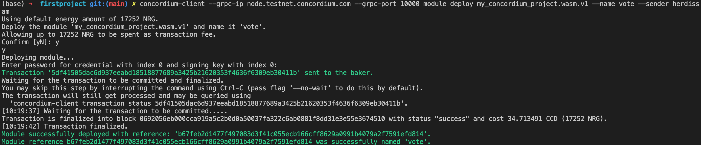
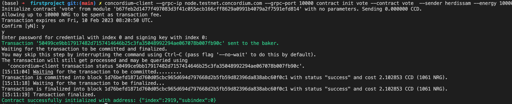
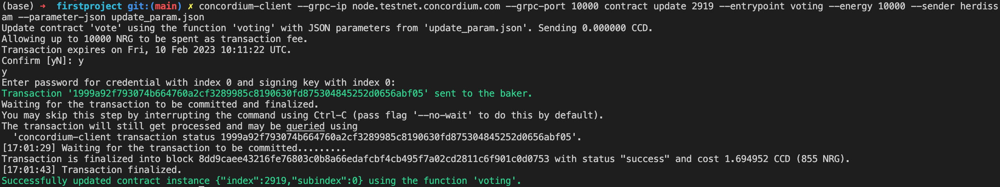
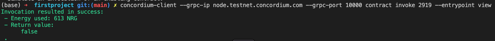

# Task 2: Deploy Your First Smart Contract

By looking to the guidline, i was created own smart contract for Voting. Once having set up then create working directory by using
````
cargo concordium init
````
and select default option

Then creating `State` stuct with boolean parameter `vote`, iniatilly assign `vote` with `false` value since in the beginning it doenst have voted yet but will update it with `true` if already voted.

## Deploy
using this command to deploy you contract with name: vote and my waller as sender
```
concordium-client --grpc-ip node.testnet.concordium.com --grpc-port 10000 module deploy my_concordium_project.wasm.v1 --name vote --sender herdissam
```

here is transaction hash after it deployed
```
5df41505dac6d937eeabd18518877689a3425b21620353f4636f6309eb30411b
```




and its reference code
```
b67feb2d1477f497083d3f41c055ecb166cff8629a0991b4079a2f7591efd814
```

## Init Smart Contract

for initiation `vote` contract using this command 

```
concordium-client --grpc-ip node.testnet.concordium.com --grpc-port 10000 contract init vote --contract vote  --sender herdissam --energy 10000
```

contract sucessfully initite with transaction code below:
```
50499ce9bb17917482d7157414646b25c3fa35048992294ae067078b007fb90c
```


## Update

we want to update `vote` contract with this input (udpate-param.json)
```
false
```

we can use this command

```
concordium-client --grpc-ip node.testnet.concordium.com --grpc-port 10000 contract update 2919 --entrypoint voting --energy 10000 --sender herdissam --parameter-json update_param.json
```

contract sucessfully update with transaction code below:
```
1999a92f793074b664760a2cf3289985c8190630fd875304845252d0656abf05
```


## Invoke

finally we want to invoke the return value `view` using this command

```
concordium-client --grpc-ip node.testnet.concordium.com --grpc-port 10000 contract invoke 2919 --entrypoint view
```



## MainnertWallet

````
4GMMzztjocEkEVNVc2ep8DoNGzzGxQtGPZ8ZKtJKFwz61xih1t
````
